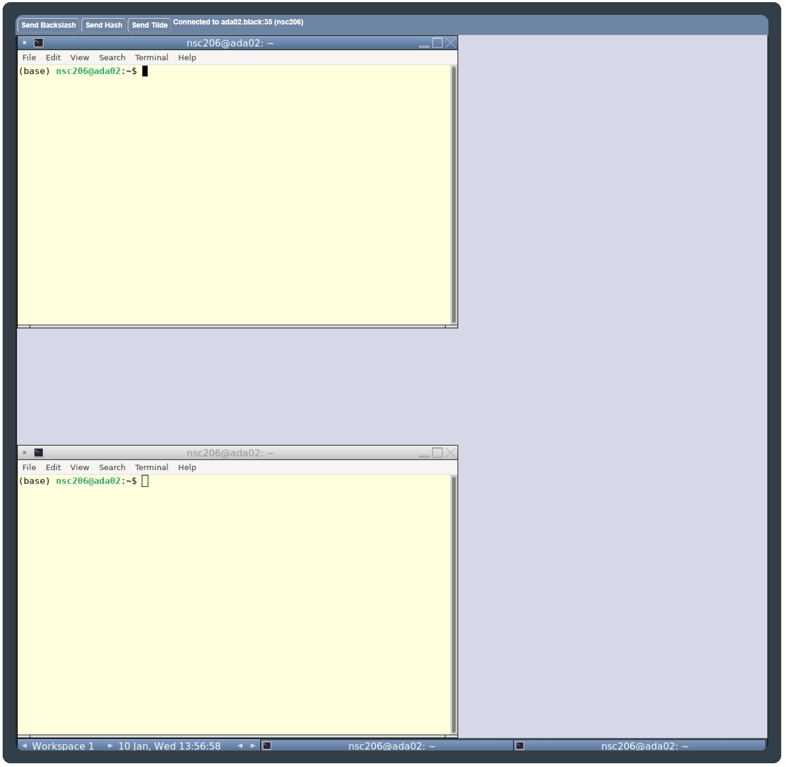

# Cluster Introduction {#cluster}

<center>
{width=250px}
</center>

## Logon Instructions

For this workshop we will be using Virtual Network Computing (<u id='vnc'>VNC</u>). Connect to the <u id='vnc'>VNC</u> with a browser by using the webVNC link you were sent.

You will now be in a logged-in Linux <u id='vnc'>VNC</u> desktop with two terminals. You will see something as below (there may be only one terminal which is fine). If you do not see something similar please ask for assistance.

<center>
{width=750px}
</center>

If you do not see something similar please ask for assistance.

If the <u id='vnc'>VNC</u> is taking up too much/little space of your browser you can use the zoom of your browser to adjust the size. Ensure you can see one whole terminal.

`r hide("How to zoom with your browser")`
You may need to zoom out with your browser so you can see the full webVNC window.

- __Chrome__: Click on the __three dots in vertical line__ (
```{r, echo=FALSE}
icons::icon_style(icons::ionicons("ellipsis-vertical"), background="white", border="solid white")
``` 
) on the top left for a dropdown menu which includes zoom options.
- __Edge__: Click on the __three horizontal lines__ (
```{r, echo=FALSE}
icons::icon_style(icons::ionicons("ellipsis-horizontal"), background="white", border="solid white")
``` 
) on the top left for a dropdown menu which includes zoom options.
- __Firefox__: Click on the __three dots in horizontal line__ (
```{r, echo=FALSE}
icons::icon_style(icons::fontawesome("bars", style="solid"), background="white", border="solid white")
```
) on the top left for a dropdown menu which includes zoom options.
`r unhide()`

## The Terminal Window
In our case the terminal window looks like the picture below. We are using the terminal window as our shell to interpret our commands to the kernel. Depending on your system and preferences it may look different.

<center>
{width=750px}
</center>

You're now ready to start the workshop!

## Load workshop data
Before we get started, we need to copy across some data files to analyse later in the workshop.

In the terminal window, issue the following commands to copy the data into your account's home space:

```{bash, eval=FALSE}
cd ~
cp -r /pub14/tea/nsc206/NEOF/Python_course_data .
```

## Mamba
<center>
{style="width:200px; border-radius:5px"}
</center>

This workshop requires some programs. 
These can be difficult to install. 
Instead we have used Miniforge to install the programs including Jupyter-notebook. 
To learn more about Miniforge and how to create your own environment please see the [appendix](#mamba_install).

To set-up your environment for this workshop please run the following code (you must include the full stop and space at the front of the command).

```{bash, eval=FALSE}
. usepython
```

You will have successfully activated the environment if you now see `(python)` at the start of your command prompt. 
This indicates you are now in the mamba environment called `python` created by the instructor.

If you are interested in the use script you can look at its contents.

```{bash, eval=FALSE}
less /usr/local/bin/usepython
```

__Tip:__ press `q` to quit `less`.

For more about mamba and how to create your own `python` environment please see the [appendix](#mamba_install)

```{r, echo=FALSE}
#Tippy tooltips
tippy::tippy_this(elementId = "vnc", 
                  tooltip = "Virtual Network Computing",
                  arrow = TRUE, placement = "bottom")
```