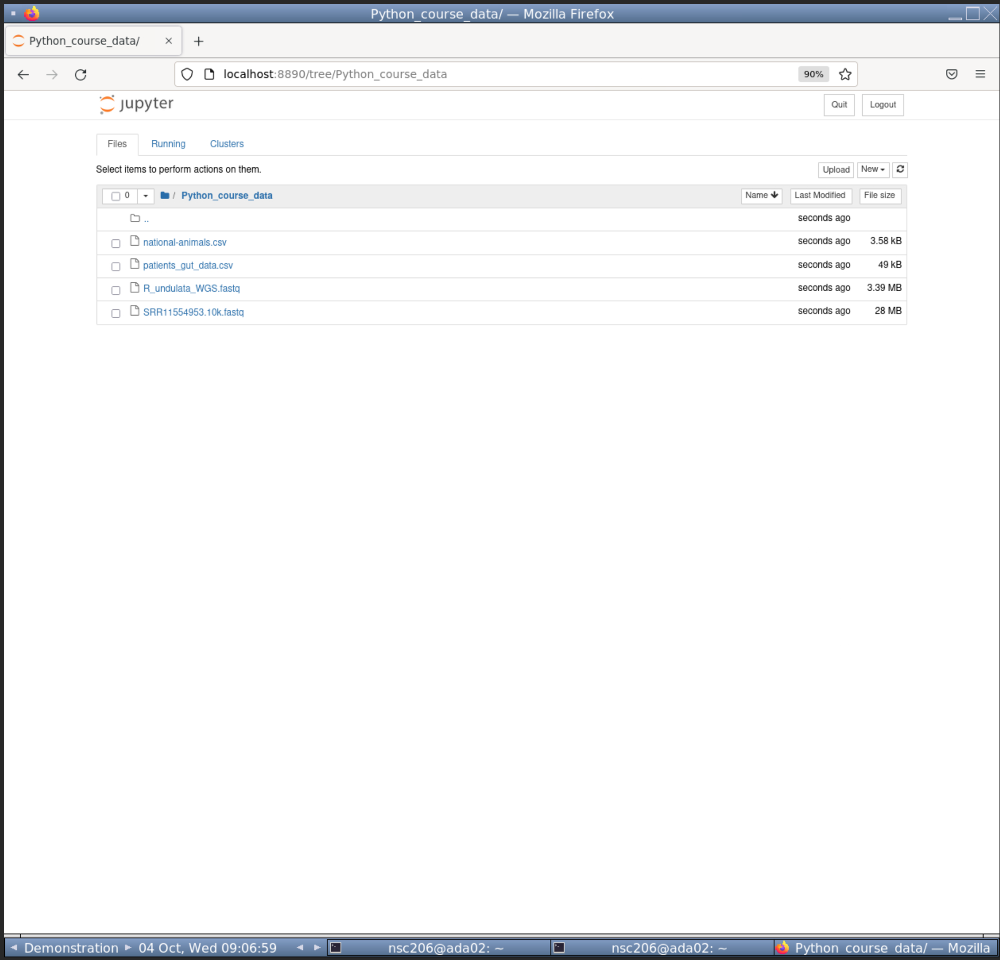
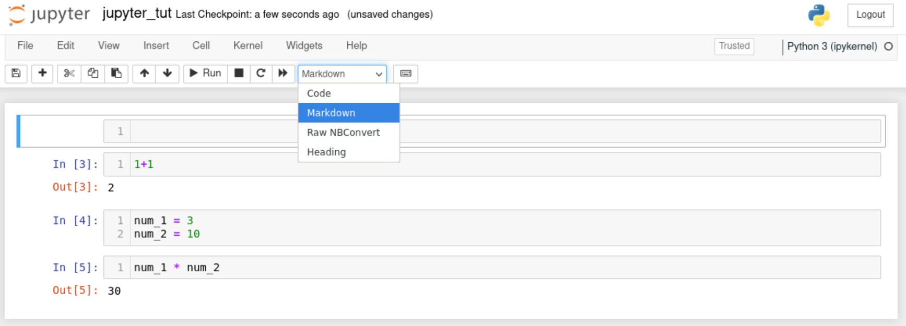

# Jupyter {#jupyter}
<center>
{style="width:200px; background:white; border-radius:5px"}
</center>

[`Jupyter-notebook`](https://jupyter.org/) is a nice browser based method to write, edit, and run code. It was initially created for Python coding, but has since branched out to many other languages, such as `R`.

We are using it in this workshop for a variety of its properties:

-   It is popular and well maintained.
-   It is lightweight. Other heavier weight programs would struggle in our HPC due to the graphical and CPU load.
-   It is interactive and displays code output.
-   It allows for easier annotation, editing, and debugging compared to the command line.
-   It provides a graphical interface for changing directories and choosing files.

Before carrying out any analysis we will go through a quick tutorial of `jupyter-notebook`.

## Open Jupyter-notebook

The first step is to open `jupyter-notebook`. Run the below command in your `(python)` environment.

```{bash, eval=FALSE}
jupyter-notebook
```

This will open `jupyter-notebook` in firefox. We won't need to access the linux terminal in this book anymore. Leave the terminal running `jupyter-notebook` and full screen your `firefox` so you should see something like below.

`r hide("Can't see the whole webVNC window?")`
You may need to zoom out with your browser so you can see the full webVNC window.

- __Chrome__: Click on the __three dots in vertical line__ (
```{r, echo=FALSE}
icons::icon_style(icons::ionicons("ellipsis-vertical"), background = "white")
``` 
) on the top right for a dropdown menu which includes zoom options.
- __Edge__: Click on the __three dots in horizontal line__ (
```{r, echo=FALSE}
icons::icon_style(icons::ionicons("ellipsis-horizontal"), background = "white")
``` 
) on the top right for a dropdown menu which includes zoom options.
- __Firefox__: Click on the __three horizontal lines__ (
```{r, echo=FALSE}
icons::icon_style(icons::fontawesome("bars", style="solid"), background = "white")
```
) on the top right for a dropdown menu which includes zoom options.
`r unhide()`

<center>
{style="width:1000px"}
</center>

## Changing directories

To move around the directories you can click on directory names.

Click on __"Python_course_data"__ to move into that directory. You will then see the below showing the files in the directory.

<center>
{style="width:1000px"}
</center>

## Create notebook

The next step is to create a python notebook.

1.  Click on the **"New"** button towards the top right, right of the "Upload" button.
2.  From the dropdown click __Python 3 (ipykernel)__.

This will open up a new Python notebook like below.

<center>
{style="width:1000px"}
</center>

## Cells and code

`Jupyter-notebook` uses **cells** (the gray boxes) to separate code. This is very useful to compartmentalise our code.

There will already be one **cell**. Within the **cell**, type in the below command.

```{python, eval=FALSE}
1+1
```

When pressing enter in **cells** it will create a new line. To run all commands in a **cell** press `CTRL + enter`.

Run your current **cell** and you should see something like below.

<center>
{style="width:1000px"}
</center>

## Create new cells

You can create new **cells** by 2 different means.

1.   Press the `+` button on the tool bar, between the floppy disk (
```{r, echo=FALSE}
icons::icon_style(icons::ionicons("save-outline"), background = "white")
``` 
) and scissors(
```{r, echo=FALSE}
icons::icon_style(icons::ionicons("cut"), background = "white")
``` 
). 
This will add a **cell** below your currently selected **cell**.
2.   Click on the **`Insert`** button and use the dropdown to add a cell above or below your currently selected cell.

**Tip:** Hover over the toolbar icons to display a text based description of its function.

With that knowledge add a second **cell** below the first **cell**. Add the following code to your second **cell** but do not run it.

```{python, eval=FALSE}
num_1 = 3
num_2 = 10
```

**Tip:** Notice there are green lines around your selected cell.

Insert a third **cell** and add the following code to it. Do not run the code.

```{python, eval=FALSE}
num_1 * num_2
```

## Running code

Try to run the code in the third **cell**. There should be an error as we have not created the objects `num_1` & `num_2`. We have only written the code for these objects but not run them.

We can run all the code in a notebook starting from the first **cell** to the last **cell**.

To run all **cells** from the start:

-   Click on the **"Cell"** button.
-   Click **"Run All"** from the drop-down options.

You should then see something like the below in your notebook.

<center>
{style="width:1000px"}
</center>

There is no output printed for __cell__ 2 because we are assigning variables. However, the correct output for Cell 3 is below it. This is because the variables were assigned in **cell** 2 before **cell** 3 was run.

## Saving the file

<center>
{style="width:100px"}
</center>

As with many good coding interfaces we can save our notebook.

First we should rename the file. Rename the notebook to **"jupyter_tut"**:

1.  Click on the name of the notebook, currently called **"Untitled"**.
    -   This is at the very top of the notebook, right of the Jupyter logo.
2.  A pop-up called **"Rename Notebook"** will appear. Change the Name to **"jupyter_tut"**.
3.  Click **"Rename"**.

Now we can save the file. Two methods to save are:

1.   Click the floppy disk (
```{r, echo=FALSE}
icons::icon_style(icons::ionicons("save-outline"), background = "white")
```
) on the toolbar.
2.   Click on the **"File"** button. Click **"Save and Checkpoint"** from the dropdown options.

## Title cells with markdown

We will be using multiple notebooks in this workshop. We will also have multiple sections per notebook. It will be useful to create header cells with markdown to create visual separation of the different sections.

To add a header __cell__ to the top of our notebook:

-   Create a new __cell__ at the top of the notebook.
-   Click on the **"Code"** drop down and select the **"Markdown"** option.
    -   Do not choose the **"Heading"** option as it no longer works.

<center>
{style="width:1000px"}
</center>

-   Add the following to the **"Markdown"** cell to create a first level header.
    -   Ensure you have a space between the `#` and header text ("Tutorial").

```{python, eval=FALSE}
# Tutorial
```

Great, we can now add nice headers in our notebooks. **Save** the notebook once more before carrying on to the next section.

`r hide("Markdown")` 
You won't need to know more about `Markdown` but if you are interested please see the [`Markdown` guide](https://www.markdownguide.org/basic-syntax/). 
`r unhide()`

## Close the notebook

To close the notebook:

-   Click on **"File"**.
-   From the dropdown options click **"Close and Halt"**.

When you are back in the file explorer page you may not yet see the new file you saved. If so, you will need to refresh the page with the Refresh button (
```{r, echo=FALSE}
icons::icon_style(icons::ionicons("refresh"), background = "white")
```
) towards the top right.

<center>
{style="width:1000px"}
</center>

With that quick tutorial of `jupyter-notebook` we can start python scripting in the next chapter.

For more info on `jupter-notebook` please see the [appendix](#jupyter_appendix).

## Video tutorial

<div class="container">
<iframe src="https://www.youtube.com/embed/2jqOdreD1c4" 
frameborder="0" allowfullscreen class="video"></iframe>
</div>