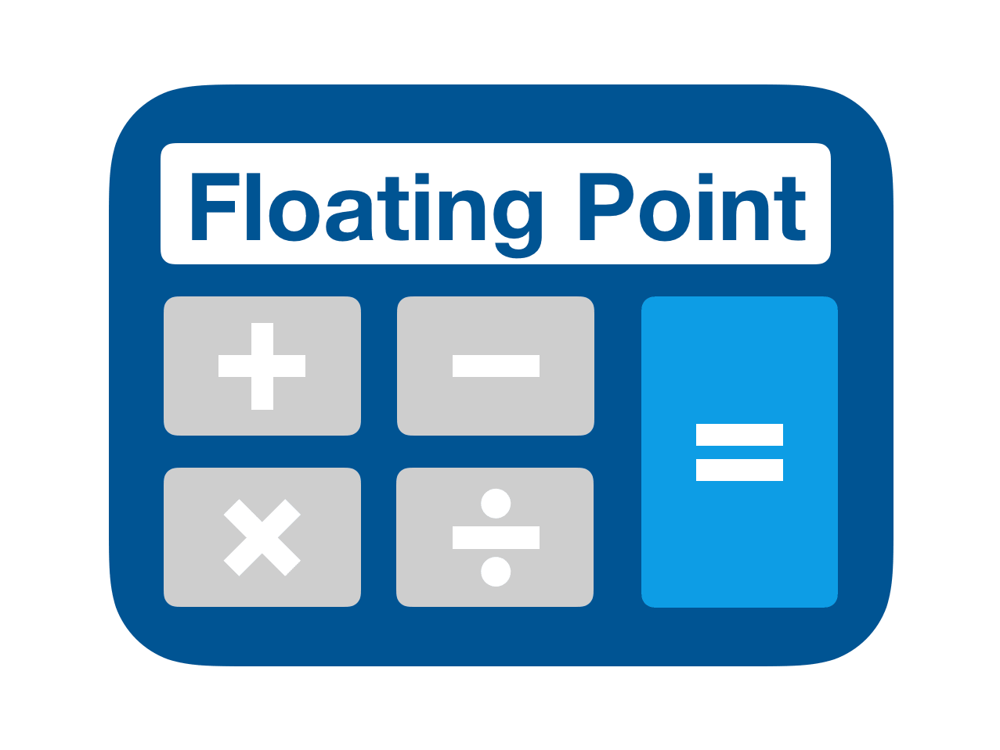

# Python Fundamentals {#python_fundamentals}
<center>
{style="width:150px; background: white; border-radius:5px; border: white solid 5px"}
</center>

This chapter covers some of the fundamental concepts of scripting in Python.
An understanding of how to use __<u id='operator'>operators</u>__, __<u id='variable'>variables</u>__, and __<u id='function'>functions</u>__ will
give a good grounding in how the language works and allow you to develop
your own methods and code.

You definitely do not need to memorise all the information here as all of these
concepts will be explored more in the rest of the tutorial. The best way to
learn how various aspects of the Python language works is by *doing* rather
than by *reading*. 

Consider coming back to this page later if you want to remind yourself of how a particular <u id='operator'>operator</u>  works or how to define a __<u id='function'>function</u>__.

We'll continue to use our __"01-Fundamentals"__ notebook. 
Within it create a new __Markdown__ cell with the following headers:

```{python, eval=FALSE}
## Fundamentals
### Operators
```

## Operators
<center>
{style="width:650px; background:white; border-radius:5px"}
</center>

Python allows the use of the usual arithmetic __<u id='operator'>operators</u>__ and follows the traditional rules of mathematical precedence (BODMAS). 

The main mathematical <u id='operator'>operators</u>  are:

- __`+`__ (addition)
- __`-`__ (subtraction)
- __`*`__ (multiplication)
- __`/`__ (division)
- __`**`__ (power/exponent)
- __`//`__ (Floor division)
- __`%`__ (modulo operator. Find the remainder after dividing 2 numbers)

For each code block below create a __code cell__, enter the code, and run it.
This will demonstrate the code output and give you some practice.

`r hide("Moving across cells in jupyter-notebook")`
For convenience you can can create a bunch of empty cells and then use the up and down arrow keys to move to other cells.
This requires knowing the two different interaction modes.

- __esc mode__: This mode allows you to move up and down between cells. You are in __esc mode__ if the highlighted border of your current cell is blue (leftside) and grey.
<center>
{style="width:950px"}
</center>
- __command mode__: This mode allows you to type in the cell. You are in __command mode__ if the highlighted border of your current cell is green.
<center>
{style="width:950px"}
</center>

Press __enter__ when on a cell in __esc mode__ to enter __command mode__. This allows you to start typing in the selected cell.

When you run code (ctrl + enter) in __command mode__ you will then enter __esc mode__.

Be careful! If you press a number key whilst in __esc mode__ you will change the cell to a __markdown cell__. Additionally, you will change the first line to a header line equal to the number you pressed. I.e. if you pressed 2, the following would be added to the start of the first line of the cell: `## `.
`r unhide()`

```{r, eval=FALSE}
1+1
```
```{python, eval=FALSE}
9-6
```
```{python, eval=FALSE}
3*4
```
```{python, eval=FALSE}
42/7
```
```{python, eval=FALSE}
45/7
```
```{python, eval=FALSE}
3**3
```
```{python, eval=FALSE}
42//7
```
```{python, eval=FALSE}
45//7
```
```{python, eval=FALSE}
45%7
```

## Comments/Annotations
<center>
{style="width:200px; background: white; border-radius:5px; border: 5px white solid"}
</center>

It is often useful to include human-readable __comments__ in your scripts and code.
__Comments/Annotations__ in Python are indicated by the hash symbol (`#`). 
Anything to the right of the hash is considered a __comment__ and is ignored by the interpreter.

Create a new __Markdown cell__ with the following.

```{python, eval=FALSE}
### Annotation
```

In a new __cell__, enter and run the below.

```{python, eval=FALSE}
# This line is a comment
print("This section will print") # This section is ignored
```

Only the `print()` command is used by the python interpreter. 
The other text is ignored due to the hashtags.
You will also notice that the text of __comments/annotations__ are uniquely coloured in `jupyter-notebook`.
This is useful to quickly see what parts are __comments__ and what parts are not.

## Variables
<center>
{style="width:200px; background:white; border-radius:5px; border: white 5px solid"}
</center>

__<u id='variable'>Variables</u>__ are used to store information which can then be referenced or manipulated later. 
It is useful to label data with descriptive names which are easily read by humans. 
You can think of a __<u id='variable'>variable</u>__ as a 'container' to hold a piece of information. 
  
__<u id='variable'>Variables</u>__ are assigned a value using the equals (`=`) character.

__<u id='variable'>Variable</u> name rules__:

- Must start with either a letter or an underscore
  - Cannot start with a number.
- Must only contain alphanumeric characters (and underscores)
  - No punctuation such as full stops, quotes, commas, colons, etc are allowed.
- They are case sensitive.

Python supports several <u id='class'>classes</u> (or types) of __<u id='variable'>variables</u>__ including __<u id='string'>strings</u>__, __<u id='integer'>integers</u>__, __<u id='float'>floats</u>__, and __<u id='boolean'>booleans</u>__.

In a new __Markdown cell__ add the following:

```{python, eval=FALSE}
### Variables
#### Strings
```

### Strings
<center>
{style="width:200px; background: white; border-radius:5px; border: 5px white solid"}
</center>

__<u id='string'>Strings</u>__ are used to store alphanumeric text. A __<u id='string'>string</u>__ is defined by enclosing the text with either single (`'text'`) or double quotes (`"text"`).
    
In the below code we define two __<u id='string'>string</u> <u id='variable'>variables</u>__, and then retrieve them again by using their name, or identifier.

As before, for each code block below create a __code cell__, enter the code, and run it.
Do this for all future code examples.
    
```{python, eval=FALSE}
#Assign string variables
DNA_string = "GCACAAACC"
amino_acids = "ARG VAL TRP"
#Call the DNA_string variable
DNA_string
```
```{python, eval=FALSE}
#Call the amino_acids string variable
amino_acids
```

You will notice that you can use your __<u id='variable'>variables</u>__ in the same __cell__ you created it in, or in a different __cell__. 
As long as you have run the code that creates/assigns the __<u id='variable'>variable</u>__ you can use it elsewhere in the same notebook.

### Integers
<center>
{style="width:200px; background:white; border-radius:5px"}
</center>

__<u id='integer'>integers</u>__ are used to store whole numbers.
These should not be declared with quote marks otherwise they will be stored as a <u id='string'>string</u>.

Create the following __markdown cell__:

```{python, eval=FALSE}
#### Integers
```
 
Create and run the following __code cells__:
    
```{python, eval=FALSE}
#Roman numeral letters
I = 1
V = 5
X = 10
L = 50
C = 100
D = 500
M = 1000
```

```{python, eval=FALSE}
I
```

```{python, eval=FALSE}
X
```

```{python, eval=FALSE}
#7
VII = V + (I * 2)
VII
```

```{python, eval=FALSE}
#67
LXVII = L + X + VII
LXVII
```

```{python, eval=FALSE}
#44
XLIV = (L - X) + (V - I)
XLIV
```

```{python, eval=FALSE}
#2023
MMXXIII = (M * 2) + (X * 2) + (I * 3)
MMXXIII
```

### Floats (floating point numbers)
<center>
{style="width:200px; background:white; border-radius:5px; border: white solid 5px"}
</center>

**<u id='float'>Floating point numbers</u>** are used to store real numbers (I.e. a number written with a decimal point dividing the <u id='integer'>integer</u> and the fractional parts).

Create a new __markdown cell__ with the following:

```{python, eval=FALSE}
#### Floats
```

Run the following code:

```{python, eval=FALSE}
my_float = 7.0001
another_float = 345.765
yet_another_float = -5.423e+19
```
```{python, eval=FALSE}
my_float
```
```{python, eval=FALSE}
another_float
```
```{python, eval=FALSE}
yet_another_float
```
  
### Booleans
<center>
{style="width:200px; background: white; border-radius:5px; border: 5px white solid"}
</center>

**<u id='boolean'>Booleans</u>** are a special type of <u id='variable'>variable</u> that can represent one of
two values: __True__ or __False__. 
You can compare any two values in Python and get a result of either __True__ or __False__.

- To check if two values are equal we use double equals: `==`
- To check if two values are not equal we use: `!=`
- Greater than (`>`) or less than (`<`) also work.

Create a new __markdown cell__ with the following:

```{python, eval=FALSE}
#### Booleans
```

Run the following code:

```{python, eval=FALSE}
1 == 1
```
```{python, eval=FALSE}
1 == 2
```
```{python, eval=FALSE}
2 == 17
```
```{python, eval=FALSE}
2 != 17
```
```{python, eval=FALSE}
(10 * 2) < 30
```
```{python, eval=FALSE}
(10 * 30) > 20
```
```{python, eval=FALSE}
#Use one of our previously created integer variables
a_bool = X > 4
a_bool
```
```{python, eval=FALSE}
#Check if 2 string variables are identical
#Cannot use > or < with strings
another_bool = DNA_string == amino_acids
another_bool
```
```{python, eval=FALSE}
#Can compare if boolean variables are identical
yet_another_bool = a_bool == another_bool
yet_another_bool
```
  
## Classes of variable
<center>
{style="width:200px; background:white; border-radius:5px; border: 5px white solid"}
</center>

Every __<u id='variable'>variable</u>__ in Python has a __<u id='class'>class</u>__. These are the characteristics we described above:

- __<u id='string'>String</u>__ (`<class 'str'>`)
- __<u id='integer'>Integer</u>__ (`<class 'int'>`)
- __<u id='float'>Float</u>__ (`<class 'float'>`)
- __<u id='boolean'>Boolean</u>__ (`<class 'bool'>`)

Unlike some other languages, you do not need to tell Python which __<u id='class'>class</u>__ a __<u id='variable'>variable</u>__ should have. 
Python will try to figure it out based on the value assigned.

Create a new __markdown cell__ with the following:

```{python, eval=FALSE}
### Classes
```

You can check the __<u id='class'>class</u>__ of a __<u id='variable'>variable</u>__ by passing it to the `type()` __<u id='function'>function</u>__:

```{python, eval=FALSE}
variable1 = "a piece of text"
type(variable1)
```
```{python, eval=FALSE}
variable2 = 5
type(variable2)
```
```{python, eval=FALSE}
variable3 = 7.0001
type(variable3)
```
```{python, eval=FALSE}
variable4 = True
type(variable4)
```
  
## Transforming variables
<center>
{style="width:200px; background:white; border-radius:5px"}
</center>

__<u id='variable'>Variables</u>__ can be transformed from one __<u id='class'>class</u>__ to another provided the value can be coerced into the new data type (I.e. you could not transform a  __<u id='string'>string</u>__ of text to a __<u id='float'>floating point numbers</u>__). 

Create a new __markdown cell__ with the following:

```{python, eval=FALSE}
### Transforming variables
```

To transform a __<u id='float'>float</u>__ to an __<u id='integer'>integer</u>__ use the `int()` __<u id='function'>function</u>__ (note the loss of precision):
```{python, eval=FALSE}
a_float = 17.45
int(a_float)
```
    
To transform an __<u id='integer'>integer</u>__ to a __<u id='string'>string</u>__ use the `str()` __<u id='function'>function</u>__:
```{python, eval=FALSE}
an_integer = 783473
str(an_integer)
```

You can transform a numeric __<u id='string'>string</u>__ to an __<u id='integer'>integer</u>__:
```{python, eval=FALSE}
a_numeric_string = "256"
int(a_numeric_string)
```

You can also transform to a __<u id='float'>floating point</u>__ using `float()`:
```{python, eval=FALSE}
a_float_string = "3.14"
float(a_float_string)
```

## Why so many code cells?
<center>
{style="width:200px; background: white; border-radius:5px; border: 5px white solid"}
</center>

We are using a __code cell__ per piece of code that gives an output. 
We do this as when using `jupyter-notebook` with `python` it will normally only show the last output from a __code cell__.

Create and run the below __code cells__ to see this in action.

```{python, eval=FALSE}
1+1
2+2
```

```{python, eval=FALSE}
1 == 1
2 > 4
```

However, you can use the `print()` <u id='function'>function</u> to bypass this. 
The output from every single `print()` <u id='function'>function</u> will be printed in `jupyter-notebook`.

Try it out with the below single __code cell__:

```{python, eval=FALSE}
print(1+1)
print(2+2)
print(1 == 1)
print(2 > 4)
```

This is essential when writing longer pieces of code that need multiple outputs.
In this book we will stick with the multiple __code cells__ approach as we find it easier than having to use `print()` constantly.
However, if you prefer using fewer __code cells__ and more `print()` __<u id='function'>functions</u>__ please feel free to do so.

## Fundamentals MCQ recap
<center>
{style="width:200px; background: white; border-radius:5px; border: 5px white solid"}
</center>

Brilliant! That is the end of this chapter. 
Have you saved your notebook?
It is good practice to save it regularly.

Choose the correct option to complete each sentence below:

```{r, echo = FALSE}
opts_p <- c(answer="__Class__", "__Comments__", "__String__")
```
1. All __variables__ have a ________. `r longmcq(opts_p)`

```{r, echo = FALSE}
opts_p <- c("__Class__", answer="__Comments__", "__String__")
```
2. The hashtag (`#`) can be used to add ________ to code. `r longmcq(opts_p)`

```{r, echo = FALSE}
opts_p <- c("__Class__", "__Comments__", answer="__String__")
```
3. Quotes ('single' or "double") are used to create ________ __variables__. `r longmcq(opts_p)`

```{r, echo = FALSE}
opts_p <- c("__Boolean__", "__Float__", answer="__Integer__")
```
4. ________ is a numeric __class__ which __does not__ contain decimal points (whole numbers). `r longmcq(opts_p)`

```{r, echo = FALSE}
opts_p <- c("__Boolean__", answer="__Float__", "__Integer__")
```
5. ________ is a numeric __class__ which __does__ contain decimal points (real numbers). `r longmcq(opts_p)`

```{r, echo = FALSE}
opts_p <- c(answer="__Boolean__", "__Float__", "__Integer__")
```
6. ________ is a __class__ that stores `True` or `False`. `r longmcq(opts_p)`

```{r, echo=FALSE}
#Tippy tooltips
tippy::tippy_this(elementId = "function", 
                  tooltip = "Named block of code that performs specific tasks",
                  arrow = TRUE, placement = "bottom")
tippy::tippy_this(elementId = "operator", 
                  tooltip = "+, -, *, /, and more",
                  arrow = TRUE, placement = "bottom")
tippy::tippy_this(elementId = "string", 
                  tooltip = "Text, denoted by quotes (\"text\" or 'text')",
                  arrow = TRUE, placement = "bottom")
tippy::tippy_this(elementId = "integer", 
                  tooltip = "Whole numbers, e.g. 1, 2, 3, etc",
                  arrow = TRUE, placement = "bottom")
tippy::tippy_this(elementId = "float", 
                  tooltip = "Real numbers (can contain decimal point), e.g. 1, 2.5, 3.14, etc",
                  arrow = TRUE, placement = "bottom")
tippy::tippy_this(elementId = "boolean", 
                  tooltip = "True or False",
                  arrow = TRUE, placement = "bottom")
tippy::tippy_this(elementId = "variable", 
                  tooltip = "Container of information with a name",
                  arrow = TRUE, placement = "bottom")
tippy::tippy_this(elementId = "class", 
                  tooltip = "Type of data, e.g. string, integer, float, boolean, etc.",
                  arrow = TRUE, placement = "bottom")
```