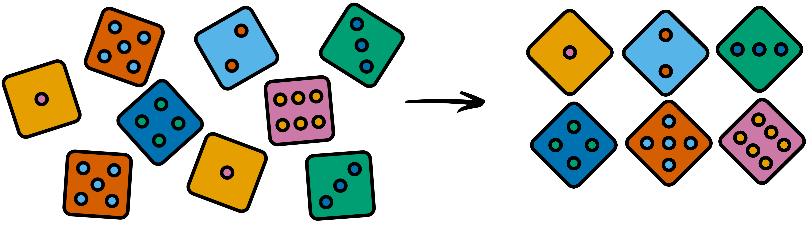

# Data Structures {#data_structures}
<center>
{style="width:200px; background:white; border-radius:5px"}
</center>

We now know the different types of data points that Python can hold, whether
they are __<u id='integer'>integers</u>__, __<u id='float'>floats</u>__, __<u id='string'>strings</u>__ of text, or __<u id='boolean'>boolean</u>__ values.

Typically, data points do not exist in isolation but instead are in a group. 
For example, consider a set of measurements of the peak day temperature over
a period of a week. 
A group of data points such as these can be stored in a __<u id='list'>list</u>__.

Use the same notebook (__"01-Fundamentals"__) and add the following __markdown cell__:

```{python, eval=FALSE}
## Data structures
### Lists
```

From now on you won't be instructed to make __markdown cells__, instead use your judgement and make your own.

## Lists
<center>
{style="width:200px; background:white; border-radius:5px"}
</center>

__<u id='list'>Lists</u>__ are used to store multiple items within a single __<u id='variable'>variable</u>__. 
__<u id='list'>Lists</u>__ allow duplicate values and once defined are always in the same order (__ordered__).
Additional items can be added to the __<u id='list'>list</u>__ and by default will appear at the end.
Finally, __<u id='list'>lists</u>__ are indexed meaning that we can easily retrieve the 1st, 2nd....nth item from the __<u id='list'>list</u>__.

We define a __<u id='list'>list</u>__ like any other __<u id='variable'>variable</u>__. 
To add multiple values to the __<u id='list'>list</u>__ we enclose them in square braces (`[]`) and include a comma between each value.

Create the __<u id='list'>list</u>__ in the below code block. 
It consists of made up fold-change values generated by an RNA-Seq type experiment.

```{python, eval=FALSE}
gene_fold_change = [0.25, -0.42, 0.62, 1.27, -0.5, 0]
gene_fold_change
```

To add an additional value to the **end** of the __<u id='list'>list</u>__, we can use the `.append()` __<u id='method'>method</u>__:

__Reminder__: Each unique __<u id='method'>method</u>__ can only be used on one type of data. The `.append()` method can only be used with __<u id='list'>lists</u>__.

```{python, eval=FALSE}
gene_fold_change.append(0.33)
gene_fold_change
```

You can create __<u id='list'>lists</u>__ containing <u id='string'>strings</u>.

```{python, eval=FALSE}
taxonomy_levels = ["Kingdom", "Phylum", "Class", "Order", "Family", "Genus", "Species"]
taxonomy_levels
```

You can even create __<u id='list'>lists</u>__ with multiple data __<u id='class'>classes</u>__.

```{python, eval=FALSE}
numerals = ["I", 1, "V", 5, True]
numerals
```

## Subsetting data
<center>
{style="width:150px; background:white; border-radius:5px"}
</center>

A value from a __<u id='list'>list</u>__ can be retrieved by the **position** it occupies in the <u id='list'>list</u>.
This selection can be carried out using square braces (`[]`).

This process of selecting a certain portion of data is known as __subsetting__.

One of the most vital aspects to grasp for Python is that data structures start at position __zero__.
This can be confusing but is a common feature of many programming languages.

### Single values
<center>
{style="width:200px; background:white; border-radius:5px; border:white solid 5px"}
</center>

To select the first entry in a __<u id='list'>list</u>__ we pass position "0" in the square braces:

__Reminder__: Create your own informative __markdown cells__.

```{python, eval=FALSE}
#Get the first value
gene_fold_change[0]
```
```{python, eval=FALSE}
#Get the fifth value
gene_fold_change[4]
```

We can also use a negative value to count from the other end of the __<u id='list'>list</u>__. I.e. to get the last value in the __<u id='list'>list</u>__.

```{python, eval=FALSE}
#Get the last value (without knowing the length of the list)
gene_fold_change[-1]
```

### Multiple values
<center>
{style="width:200px; background:white; border-radius:5px; border:white 5px solid"}
</center>

The same technique also works to select a range of values from the __<u id='list'>list</u>__. 
The upper and lower positions of the range are selected. 
These are given in square brackets, separated by a colon (`X:Y`). 

When using a range in this manner:

- The first number (`X:`) is inclusive. 
- The last number (`:Y`) is exclusive.

In other words all the positions except the last one will be selected.

Try out the following code blocks to see this in practice.

```{python, eval=FALSE}
#Create a list containing the numbers 1 to 7
one_to_seven = [1,2,3,4,5,6,7]
one_to_seven
```
```{python, eval=FALSE}
#Subset the third and fourth values
one_to_seven[2:4]
```
```{python, eval=FALSE}
#Subset the first to fifth values
one_to_seven[0:5]
```
```{python, eval=FALSE}
#Subset the first value
one_to_seven[0:1]
```

If you find this confusing you are not the only one so please don't feel bad about it.
It will take time and effort for most people to get used to this.

To subset everything from a certain position onwards, leave the upper value blank. This also works to select everything before a certain position.

```{python, eval=FALSE}
#Subset the sixth value to the end
one_to_seven[5:]
```
```{python, eval=FALSE}
#Subset everything up to (but excluding) the third value
one_to_seven[:2]
```

__<u id='list'>Lists</u>__ are incredibly useful but have their limitations so it is good to learn other data structures.

## Set
<center>
{style="width:200px; background:white; border-radius:5px; border: 5px white solid"}
</center>

A __<u id='set_tooltip'>set</u>__ is similar to a __<u id='list'>list</u>__ except that it can only hold __unique__ values.
A __<u id='set_tooltip'>set</u>__ also differs from a __<u id='list'>list</u>__ in that they do not retain the order of the elements (unordered).

__<u id='set_tooltip'>Sets</u>__ are defined using the curly braces (`{}`). Define a __<u id='set_tooltip'>set</u>__ containing the plants found on the one pound coin. 

```{python, eval=FALSE}
plants_set = {"Leek", "Rose", "Shamrock"}
plants_set
```

We forgot the Scottish thistle! 
We can add a new element to our __<u id='set_tooltip'>set</u>__ using the `.add()` __<u id='method'>method</u>__.

```{python, eval=FALSE}
plants_set.add("Thistle")
plants_set
```

In real world analysis combining data from more samples might mean that duplicate plants were detected in the data. 
Adding values that are already in the __<u id='set_tooltip'>set</u>__ has no effect as it cannot hold duplicate values.

```{python, eval=FALSE}
plants_set.add("Shamrock")
plants_set
```

## Convert a list to a set
<center>
{style="width:700px; background:white; border-radius:5px"}
</center>

Sometimes we have a __<u id='list'>list</u>__ of non-unique values and it is useful to extract the unique values. This can be carried out by transforming a __<u id='list'>list</u>__ into a __<u id='set_tooltip'>set</u>__.

Add some gene IDs to a __<u id='list'>list</u>__.

```{python, eval=FALSE}
gene_IDs = ["Agl", "Pygm", "Pgm2", "Ugp2", "Pygm", "Pgm2"]
gene_IDs
```

We can transform the __<u id='list'>list</u>__ into a __<u id='set_tooltip'>set</u>__ using the __<u id='function'>function</u>__ `set()`.

```{python, eval=FALSE}
gene_set = set(gene_IDs)
gene_set
```

## Dictionary
<center>
{style="width:200px; background:white; border-radius:5px; border: 5px solid white"}
</center>

The third data structure we will learn is the **<u id='dictionary_tooltip'>dictionary</u>**. 
A __<u id='dictionary_tooltip'>dictionary</u>__ is an ordered data structure which holds **pairs** of values; a **key** and a **value**.

For example, say we want to store the gene identifiers alongside our fold-change data that we recorded earlier in a __<u id='list'>list</u>__. 
Each gene identifier/fold-change pair is the __key__/__value__ of the __<u id='dictionary_tooltip'>dictionary</u>__.

__<u id='dictionary_tooltip'>Dictionaries</u>__ are also defined using the curly braces but a pair of values are given each time, separated by a colon (`{key:value}`).

Enter the following. 

__Note__: You need to press enter after each line.

```{python, eval=FALSE}
gene_fold_change = {
  "Agl" : 0.25,
  "Pygm" : -0.42,
  "Pgm2" : 0.62,
  "Ugp2" : 1.27,
  "Gys1" : -0.5,
  "Phka1" : 0,
  "Phkg1" : 0.33
}
gene_fold_change
```

__<u id='dictionary_tooltip'>Dictionaries</u>__ are **indexed** meaning that individual records can be retrieved 
very quickly (important if you are working with very large dictionaries).

We can retrieve the information for "Gys1" by using the identifier as the **key** 
and the __<u id='dictionary_tooltip'>dictionary</u>__ will then return the **value**.

```{python, eval=FALSE}
gene_fold_change["Gys1"]
```

New values can be added to the __<u id='dictionary_tooltip'>dictionary</u>__ in a similar way to how they are retrieved:
```{python, eval=FALSE}
gene_fold_change["ZT1"] = 3.2
gene_fold_change["ZT1"]
```

You __cannot__ subset __<u id='dictionary_tooltip'>dictionaries</u>__ with numbers like a __<u id='list'>list</u>__.

The pairing up of values in __<u id='dictionary_tooltip'>dictionaries</u>__ is extremely useful if you are working with DNA sequence files (Fasta or FastQ).
It offers an easy way of matching up the read identifier with the DNA nucleotide data, for example. 
Once indexed, the individual records can then be accessed extremely quickly.

## Data structures MCQ recap
<center>
{style="width:200px"}
</center>

Grand! You have learnt about different data structures in __Python__.

Try choosing the correct option in the below sentences to recap what you have learnt.

```{r, echo = FALSE}
opts_p <- c("__Dictionaries__", answer="__Lists__", "__Sets__")
```
1. ________ hold an ordered catalogue of values. `r longmcq(opts_p)`

```{r, echo = FALSE}
opts_p <- c("__Dictionaries__", "__Lists__", answer="__Sets__")
```
2. ________ can only hold unique values. `r longmcq(opts_p)`

```{r, echo = FALSE}
opts_p <- c(answer="__Dictionaries__", "__Lists__", "__Sets__")
```
3. ________ hold pairs of values (key and value). They can be used to quickly access individual records, even when they are extremely large. `r longmcq(opts_p)`

```{r, echo = FALSE}
opts_p <- c("__-1__", answer="__0__", "__1__")
```
4. Data structures in Python start at position ________. `r longmcq(opts_p)`

```{r, echo = FALSE}
opts_p <- c("__Exclusive__", answer="__Inclusive__", "__Key__")
```
5. When subsetting values in a __list__ the first number (`[X:]`) is ________. `r longmcq(opts_p)`

```{r, echo = FALSE}
opts_p <- c(answer="__Exclusive__", "__Inclusive__", "__Key__")
```
6. When subsetting values in a __list__ the last number (`[:Y]`) is ________. `r longmcq(opts_p)`

```{r, echo = FALSE}
opts_p <- c("__Exclusive__", "__Inclusive__", answer="__Key__")
```
7. You can access the __value__ of a __dictionary__ with its matching ________. `r longmcq(opts_p)`

```{r, echo = FALSE}
opts_p <- c("__`.add()`__", answer="__`.append()`__", "__`set()`__")
```
8. The ________ __method__ can add a value to a __list__. `r longmcq(opts_p)`

```{r, echo = FALSE}
opts_p <- c(answer="__`.add()`__", "__`.append()`__", "__`set()`__")
```
9. The ________ __method__ can add a value to a __set__. `r longmcq(opts_p)`

```{r, echo = FALSE}
opts_p <- c("__`.add()`__", "__`.append()`__", answer="__`set()`__")
```
10. The ________ __function__ can create a __set__ from a __list__. `r longmcq(opts_p)`


We are going to be using these data structures to look at and manipulate DNA sequence data specifically, but the principles apply to any datasets stored in these structures.

Ensure you save your notebook. However, don't close it as you may find its contents useful for the next chapter of exercises.

```{r, echo=FALSE}
#Tippy tooltips
tippy::tippy_this(elementId = "list", 
                  tooltip = "list = [value1,value2]",
                  arrow = TRUE, placement = "bottom")
tippy::tippy_this(elementId = "set_tooltip", 
                  tooltip = "set{unique_value1,unique_value2}",
                  arrow = TRUE, placement = "bottom")
tippy::tippy_this(elementId = "dictionary_tooltip", 
                  tooltip = "dictionary = {key:value}",
                  arrow = TRUE, placement = "bottom")
tippy::tippy_this(elementId = "function", 
                  tooltip = "function_name(variable)",
                  arrow = TRUE, placement = "bottom")
tippy::tippy_this(elementId = "method", 
                  tooltip = "variable.method_name()",
                  arrow = TRUE, placement = "bottom")
tippy::tippy_this(elementId = "operator", 
                  tooltip = "+, -, *, /, and more",
                  arrow = TRUE, placement = "bottom")
tippy::tippy_this(elementId = "string", 
                  tooltip = "Text, denoted by quotes (\"text\" or 'text')",
                  arrow = TRUE, placement = "bottom")
tippy::tippy_this(elementId = "integer", 
                  tooltip = "Whole numbers, e.g. 1, 2, 3, etc",
                  arrow = TRUE, placement = "bottom")
tippy::tippy_this(elementId = "float", 
                  tooltip = "Real numbers (can contain decimal point), e.g. 1, 2.5, 3.14, etc",
                  arrow = TRUE, placement = "bottom")
tippy::tippy_this(elementId = "boolean", 
                  tooltip = "True or False",
                  arrow = TRUE, placement = "bottom")
tippy::tippy_this(elementId = "variable", 
                  tooltip = "Container of information with a name",
                  arrow = TRUE, placement = "bottom")
tippy::tippy_this(elementId = "class", 
                  tooltip = "Type of data, e.g. string, integer, float, boolean, etc.",
                  arrow = TRUE, placement = "bottom")
```