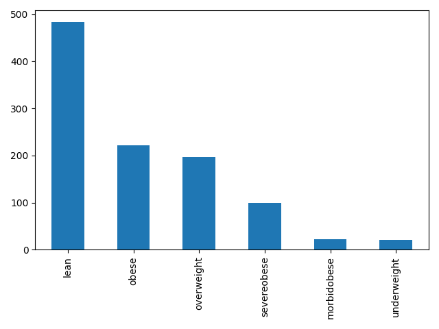
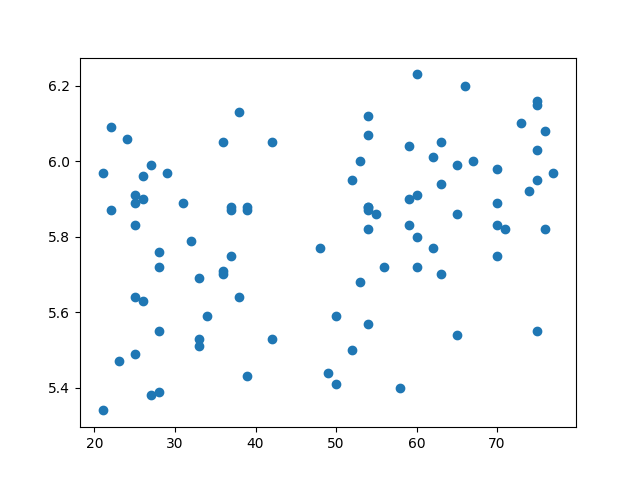

# Plotting using Python and Matplotlib
<center>{width=40%}</center>

We can also use Python to produce plots of our data.
[Matplotlib](https://matplotlib.org/) is a library of powerful
plotting tools.

## Import Matplotlib
Add a new line to the <b>top</b> of the Python script containing the work in pandas (script04.py). We need to import a new library: matplotlib, and specifically the pyplot suite of functions.

To save us having to type out "matplotlib.pyplot" repeatedly in our script, we can set it as an abbreviated form "plt".

```
import matplotlib.pyplot as plt
```

## Produce a Simple Bar Chart
Again, considering the patients.csv dataset, let's see which is the most common bmi group and generate a bar chart.

To the bottom of the script, add the following. We are using the value_counts() method to count how many individuals are in each group.

```
#print(average(patients.diversity))

bmi_counts = (patients['bmi_group'].value_counts())
print(bmi_counts)
```

We can then use Matplotlib to plot this data in order to visualise these groups. To our bmi_counts data we apply the plot() method, and specify that we would like a bar chart. Once the plot has been generated in the computer, we need to save it to the disk so that we can view it.

Add/modify the following:

```
#print(bmi_counts)

# generate the plot
bmi_counts.plot(kind='bar')

# automatically adjust borders to fit axis ticks
plt.tight_layout()

# save the plot to the disk
plt.savefig(wd + '/bmi_groups.png')

# close the plotting device
plt.close()
```

In <b>terminal</b> window, run the following the view the plot:

```
cd ~
firefox bmi_groups.png
```

<center>{width=80%}</center>


## Use Matplotlib to produce a scatter plot
We can also look for relationships between a pair of variables. Consider the age and diversity of gut microbiome of the first 100 patients (for clarity).

```
# generate the scatter plot of the first 100 rows
plt.scatter(patients.age[0:99], patients.diversity[0:99])

# write the plot to the disk
plt.savefig(wd + '/age_diversity_plot.png')

# close the plotting device
plt.close()
```

View the plot by running the following in the <b>terminal</b> window:

```
firefox age_diversity_plot.png
```

<center>{width=80%}</center>

## Recap
Madplotlib is a library of very powerful tools to produce plots directly from Python. We have barely scratched the surface of what Matplotlib can do but have seen a couple of examples of how we can produce plots to explore our data.


